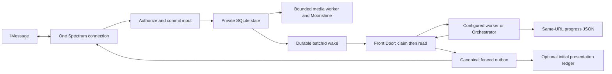

# Shared-VM architecture

The [operating contract](docs/product-repair/OPERATING_CONTRACT.md) is the single workflow authority. One Bun runtime owns one Spectrum cloud connection under a kernel instance lock. Account bots share the Grokbot VM and private instance, with SQLite enforcing the supported protocol's transactions, operation identities and current claim generations.

Input acceptance and onboarding reservation commit together. Independent conversation/line deadlines form immutable ordered batches and wake intents. Media runs after acceptance and never delays later text. HTTP 200 acknowledges a native routine start, not task completion. The consumer claims before reading for work, reacting or delegating. Unknown native handoffs remain held for reconciliation.

Front Door answers bounded conversational requests directly. A verified specialist owns a complete single-worker outcome. Master Orchestrator handles multiple owners/dependencies. Creator owns repairs; Feature Add owns new capabilities. Mixed work preserves an existing owner or selects one primary owner with bounded children. Front Door remains the sole final-response owner through every route.

The outbox binds original conversation and line, validates targets and private artifact paths, and deduplicates logical action keys. A sending attempt interrupted after possible provider acceptance becomes unknown. It never becomes a fresh send merely because a process died. Queue acceptance, provider acceptance and device observation are separate evidence.

Six roles and verified Moonshine are required at first setup. Live Mini is optional and explicitly authorized. It uses the same Spectrum outbox for initial presentation, then host JSON at the unchanged URL. No second client, transcript poller, new reasoning orchestrator, or routine per progress tick is introduced.

Private state, models, tools, logs and backups live under the resolver's `PHOTON_INSTANCE_DIR`, outside code. [Privacy](docs/product-repair/PRIVACY.md) gives paths/retention; [migration](docs/product-repair/MIGRATION.md) covers legacy import and rollback. A missing or corrupt existing DB fails closed.
