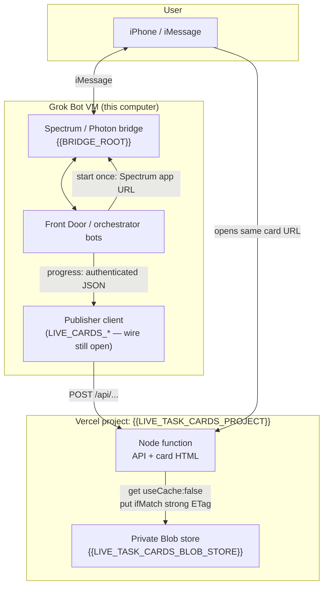
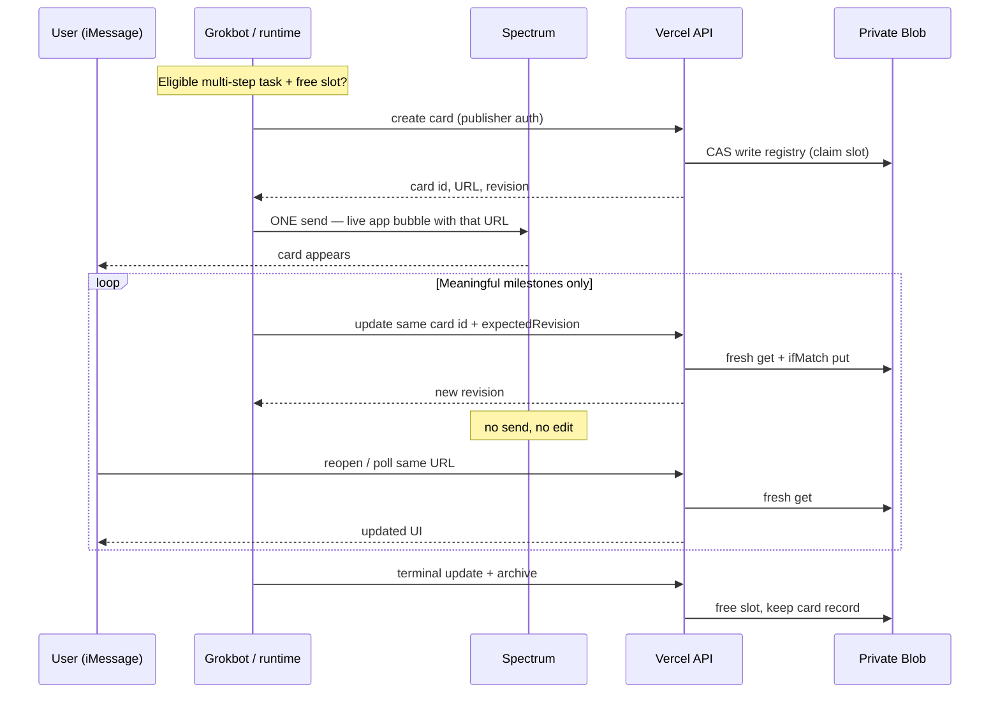
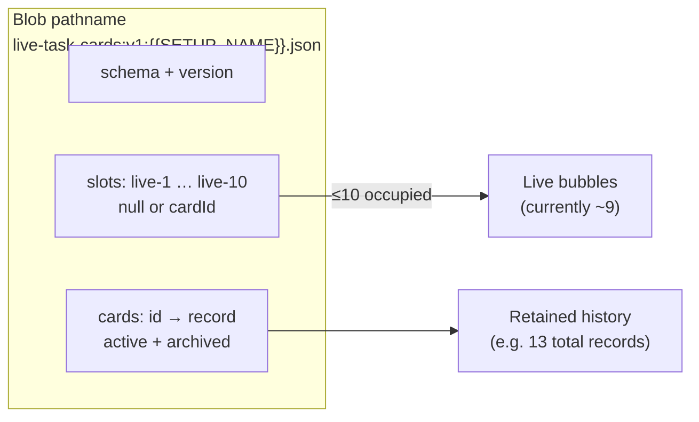
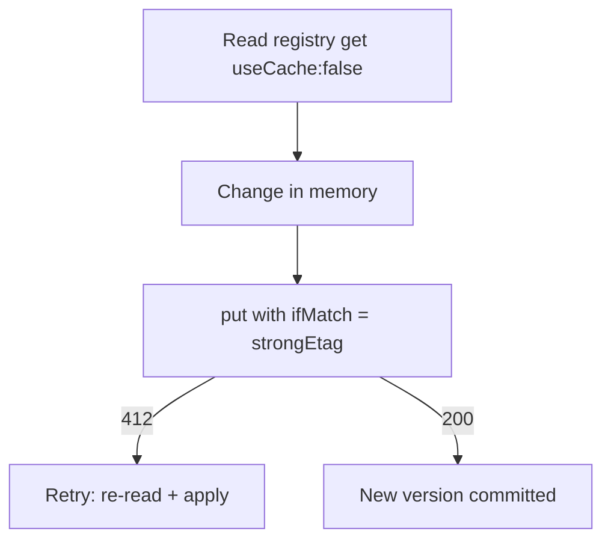
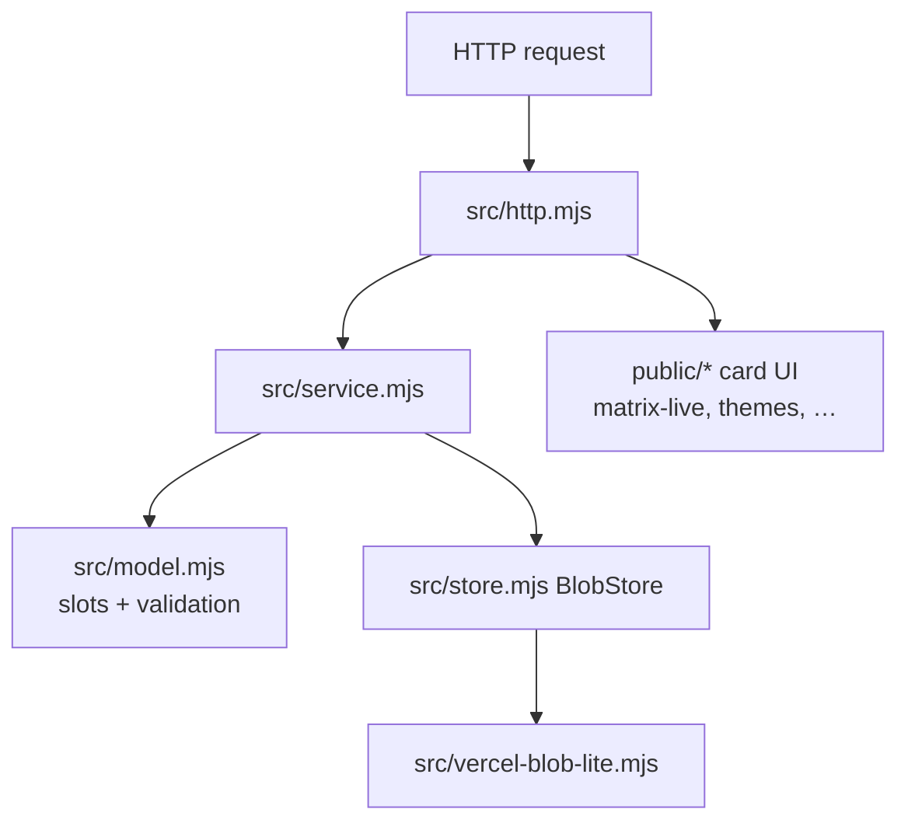
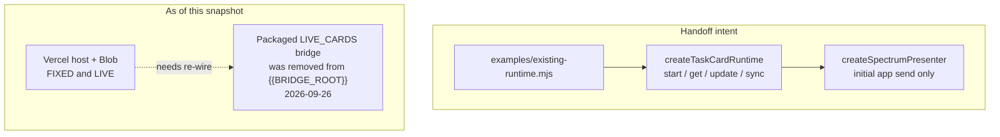
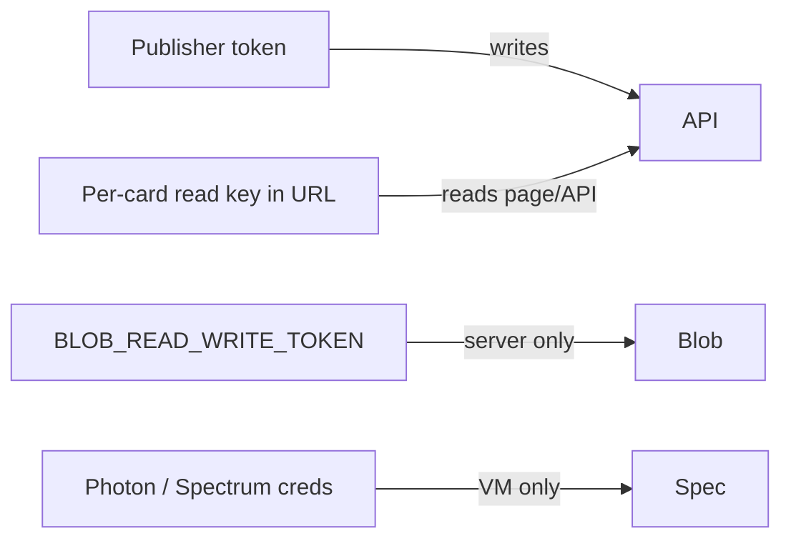

# Photon × Grok × live-task-cards — architecture

Snapshot of how the pieces fit together after the 2026-09-26 Blob CAS fix.
Production card host: `https://{{LIVE_TASK_CARDS_HOST}}` (your deployment).

---

## Where the send / update rules already live

These were **not invented in chat** — they ship with the handoff package:

| Rule | Source |
|------|--------|
| When to open a card vs stay in text | `live-task-cards/SKILL.md` |
| Prefer matrix; dark default; light only on request | `SKILL.md`, `HANDOFF.md` §5 |
| Spectrum **send once** on create; progress = JSON only | `HANDOFF.md` §4–6, `INSTALL.md`, `examples/existing-runtime.mjs` |
| Same URL forever (no replace bubble / no `edit`) | `HANDOFF.md` §6, `SKILL.md` |
| Ten slots `live-1`…`live-10` | `src/model.mjs` (`SLOT_NAMES`) |
| Blob fresh reads + strong-ETag CAS | `src/store.mjs`, `src/vercel-blob-lite.mjs`, `migration/BLOB-FIX-REPORT.md` |
| Wire into existing Spectrum runtime | `HANDOFF.md` §4, `docs/INTEGRATION.md` |

This file is a **map**. The package docs above remain authoritative for behavior.

---

## Big picture



**Ownership split**

- **Messaging** (bubbles, Spectrum `app(url)`, space, enqueue) → Grok VM / Spectrum.
- **Card state** (slots, revisions, progress JSON, card page) → Vercel + private Blob.
- Progress never needs a new Spectrum message or a redeploy.

---

## Card lifecycle (when / how)



**Send rules (short)**

1. Create card only for substantial queued work with real stages (not chat fillers).
2. Prefer `matrix` + `theme: "dark"`; `light` only if asked.
3. Spectrum: **initial send only**.
4. Updates: hosted JSON at the **exact same URL**.
5. Finish: write terminal content, release slot; history stays readable.

---

## Storage model



- **Occupied count** = how many of the 10 slots hold an active card.
- **Total cards in file** = active + archived (not a send cap; prune via `MAX_ARCHIVED_CARDS`).
- Preview uses a **separate** pathname (`…{{SETUP_NAME}}-preview.json`) so tests never touch prod.

**CAS path (why weak ETags mattered)**



Private Blob returns weak ETags (`W/"…"`). `ifMatch` needs the strong form — `strongEtag()` in `vercel-blob-lite.mjs`.

---

## Vercel host internals



Env (prod): `STORE=blob`, `BLOB_READ_WRITE_TOKEN`, `BLOB_PATHNAME`, publisher + view secrets, `PUBLIC_BASE_URL`.

---

## Grok / Spectrum side (intended vs current)



| Layer | Status |
|-------|--------|
| Package on disk | Pack folder `live-mini/live-task-cards/` (or `{{LIVE_MINI_PATH}}/live-task-cards/`) |
| Vercel host + Blob CAS | **Done on source deploy** (use your own deployment id) |
| Spectrum runtime attach | **Not done** — bridge removed; needs `existing-runtime.mjs` re-wired |
| Phone verify (send + 2 same-URL updates) | **Not done** |
| Personal loader skill wire | Optional / not done |

---

## Trust boundaries



- Blob write token stays on Vercel (and install secrets), never on the card URL.
- Photon credentials stay on the VM — not on the Vercel project.
- Card URL carries a narrowly scoped read capability, not publisher power.

---

## Key paths on this machine

```
live-mini/   (or {{LIVE_MINI_PATH}}/)
  ARCHITECTURE.md          ← this map
  live-task-cards/         ← handoff package (source of truth for card rules)
  migration/BLOB-CAS.md, DEPLOY-NOTES.md
  secrets/ (NOT shipped) — create locally; chmod 600; never paste

{{BRIDGE_ROOT}}/   ← Spectrum / iMessage runtime
```

Keep your own registry backups outside the share pack; this pack does not ship `migration/backups/`.
