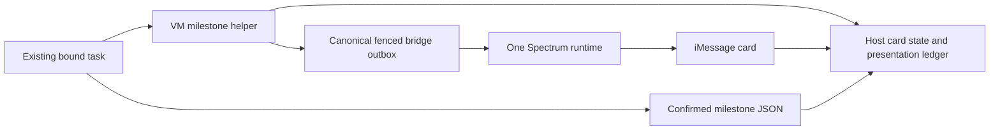

# Live Mini architecture

The [operating contract](../docs/product-repair/OPERATING_CONTRACT.md) governs the shared-VM integration. One bridge owns Spectrum. Front Door owns final delivery. The [canonical helper](runtime/README.md) uses durable original task/card context and the host's presentation claim; it never opens another client or accepts an arbitrary recipient.

Initial presentation is one operation across host and outbox, with queued/accepted/unknown/settlement-pending states kept distinct. Provider acceptance followed by host settlement failure reuses the retained receipt, never calls Spectrum again. Terminal content is saved independently, but slot release waits for reconciliation. Same-URL progress remains possible without a retained SDK message object.

Host source contains ten logical slots and immutable card identity/history. Blob persistence uses the pinned official SDK, opaque ETags and conditional mutation; create-if-absent handles an empty registry. Preview uses its own namespace. No diagnostic read clears production state. The reproducible build bundles actual runtime source/dependencies.

The VM stores bridge credentials and private helper context; Vercel stores host secrets/registry. A view URL is a narrow read capability, not publisher authority or user identity. Keep it out of logs and ordinary reports. One host is sufficient; a slot is not a new hosting project.

The older 2026-09-26 source lineage and deployment observations remain [historical notes](migration/BLOB-CAS.md). This checkout's local tests do not assert the live host has been upgraded, native milestones are wired, or an iPhone refreshed successfully.
